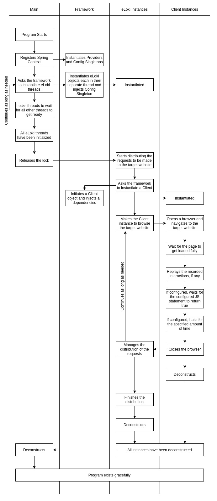
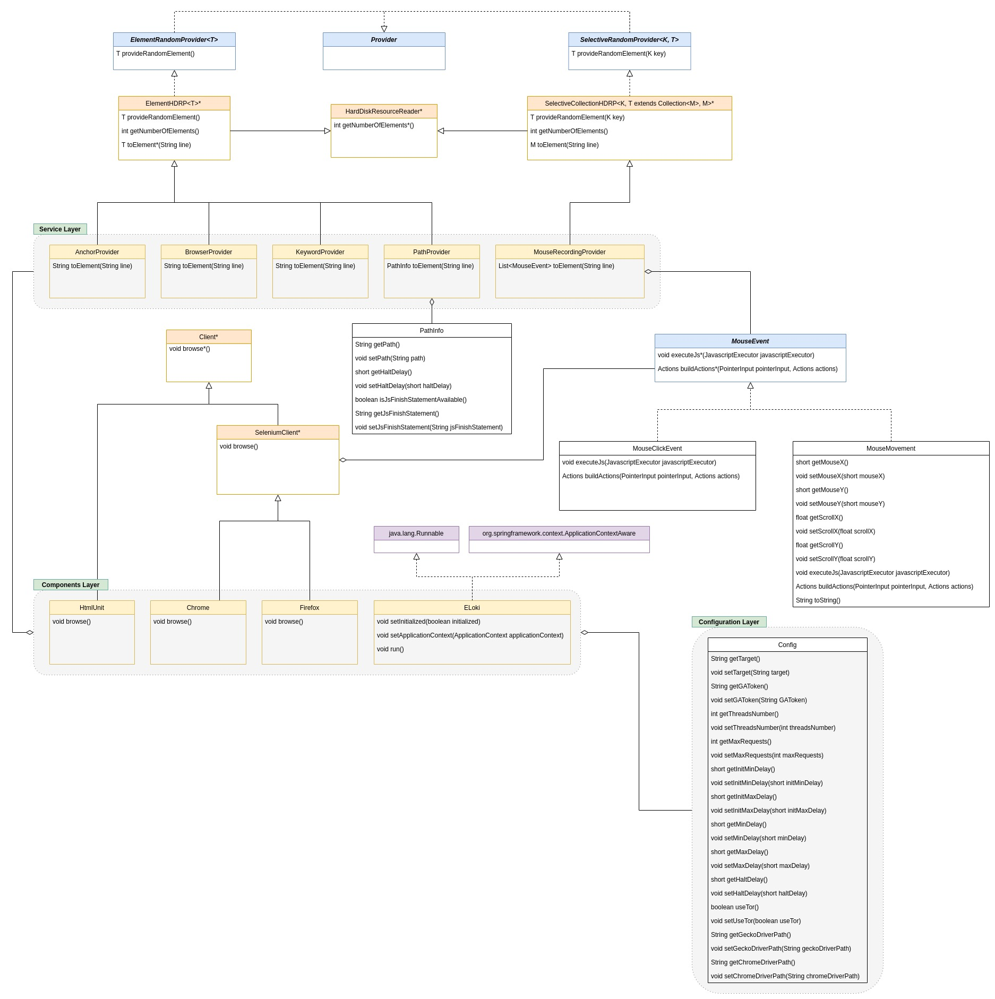

# eLoki: MWAP Attack Tool

eLoki is a Malwareless Web Analytics Pollution (MWAP) Attack tool crafted as a Computer Security Project at York University. It will be maintained and extended as active research.

## Introduction

Web analytical tools are almost as old as the World Wide Web itself. They have become an integral part of the online world; web analytics is a crucial tool for marketing teams to base their generated data decisions.
The attacker's ultimate goal is to harm a firm or business's overall performance, and polluting the web analytics data is one of the simplest ways to achieve this goal.

There are two approaches to manipulate the analytical data:
* Malware-based
* **Malwareless-based**

Malwareless Web Analytics Pollution (MWAP) attacks are more efficient and easier to execute.
[Professor N. Vlajic](http://www.cse.yorku.ca/~vlajic/) has shown the superiority of Web Analytic engines that utilize JavaScript and the potential of abusing some smarter tools.
Traditionally, hackers did have to resort to using malware and creating botnets. This previously analyzed approach has its advantages, but the attacker has to wait for the Malwareless-botnets and Puppet-nets to make the fake requests.

**In this project, we have analyzed and developed a different approach where the attacker is in full control of when, where and how the traffic is being generated.**


We have evaluated the overall feasibility and effectiveness of conducting successful MWAP attacks where the attacker can generate a large number of requests from one single machine, which he is in full control of. To make our analysis more realistic, we used free and readily available tools traditionally deployed for application layer testing and DDoS attacks.

There are two victims websites up and running at http://www.eloki.tk and http://4080eloki.net.

```bash
./victim        # The sample target website
./nodecode      # JS code to start working with Headless Chrome and Firefox, includes other needed JS code
./eloki         # eLoki project, a Maven project
./setup         # A guide to setting up AWStats on Ubuntu
./tools         # A brief description of analyzed tools
```

## Using eLoki - Road Map

To get strated with eLoki, you need to:
1. [Set up a victim website](#1-set-up-a-victim-website)
2. [Install and set up analytical tools](#2-install-and-set-up-analytical-tools)
3. [Configure eLoki to match your setup](#3-configure-eLoki-to-match-your-setup)
4. [Customize eLoki to attack the victim](#4-customize-eLoki-to-attack-the-victim)
5. [Run eLoki](#5-run-eLoki)

After getting eLoki to run, it is a good idea to move to the [How It Works](#how-it-works) section to know how everything works under the hood and how to extend eLoki.

> NOTE: This documentation uses Ubuntu 18.04 and bash to deliver the material.

# 1. Set Up a Victim Website

First, set up a server (an EC2 or any other technology, you can also use localhost for testing purposes), and log in to the terminal and set up an apache service. Apache is not a requirement, but the Apache2 on Ubuntu flavour was chosen to make a framework for this project.

> A great place to start: https://www.digitalocean.com/community/tutorials/how-to-install-the-apache-web-server-on-ubuntu-18-04

After getting to the terminal, install apache2:
```bash
$ sudo apt update
$ sudo apt upgrade
$ sudo apt install apache2
$ sudo apt install awstats libgeo-ip-perl libgeo-ipfree-perl
$ sudo systemctl status apache2
```

Now, setup the website folder:
```bash
$ sudo mkdir /var/www/<example>
$ sudo chown -R $USER:$USER /var/www/<example>
$ sudo chmod -R 755 /var/www/<example>
$ nano /var/www/<example>/index.html               # Put a test text in this file
```

Next, let's notify Apache about this location; run the following:

```bash
$ sudo nano /etc/apache2/sites-available/<example>.conf
```

The following configuration is an example:

```
<VirtualHost *:80>
    ServerAdmin saaniaki@gmail.com
    ServerName <domain_name>
    ServerAlias www.<domain_name>
    DocumentRoot /var/www/<example>
    ErrorLog ${APACHE_LOG_DIR}/<example>_error.log
    CustomLog ${APACHE_LOG_DIR}/<example>_access.log combined
</VirtualHost>
```

Then, enable the new configuration:
```bash
$ sudo a2ensite eecs.conf
$ sudo a2dissite 000-default.conf
$ sudo apache2ctl configtest
$ sudo systemctl restart apache2
# Only on localhost:
$ sudo nano /etc/hosts              # Add the domain and point to 127.0.0.1
```

The `/var/www/<example>/index.html` should be live now. Remove it and copy everything inside the `./victim` folder of this repository and put it in the `/var/www/<example>` folder on your server.

# 2. Install and Set Up Analytical Tools

## Setting Up Google Analytics

> An excellent place to start: https://support.google.com/analytics/answer/1008080

After setting up a Google account and enabling Google Analytics, the guide will ask to put the following code snippet on every page of the victim website. In the proposal files of this repository, <GAToken> is `UA-157513426-1`.

```html
<!-- Global site tag (gtag.js) - Google Analytics -->
<script async src="https://www.googletagmanager.com/gtag/js?id=<GAToken>"></script>
<script>
    window.dataLayer = window.dataLayer || [];
    function gtag() { dataLayer.push(arguments); }
    gtag('js', new Date());
    gtag('config', '<GAToken>');
</script>
```

Make sure to change the <GAToken> and put your target GAToken.

## Setting Up AWStats

> A great resource to start: https://www.linuxbabe.com/ubuntu/install-awstats-ubuntu-18-04-apache

To install AWStats on the server, run the following and then modify the configuration file:
```bash
$ sudo apt install awstats libgeo-ip-perl libgeo-ipfree-perl
$ sudo nano /etc/apache2/sites-available/<example>.conf
```
Now, put the following configuration before the `VirtualHost` closure tag:
```
Alias /awstatsclasses "/usr/share/awstats/lib/"
Alias /awstats-icon/ "/usr/share/awstats/icon/"
Alias /awstatscss "/usr/share/doc/awstats/examples/css"
ScriptAlias /cgi-bin/ /usr/lib/cgi-bin/
ScriptAlias /awstats/ /usr/lib/cgi-bin/
Options +ExecCGI -MultiViews +SymLinksIfOwnerMatch
```

Next, enable `cgi` and restart apache:
```bash
$ sudo a2enmod cgi
$ sudo systemctl restart apache2
```

Then set up the AWStats:
```bash
$ sudo cp /etc/awstats/awstats.conf /etc/awstats/awstats.<example>.conf
$ sudo nano /etc/awstats/awstats.<example>.conf
```
Now, change the following lines to suit the victim server's configuration:
```
LogFile="/var/log/apache2/<example>_access.log"
LogFormat=1
SiteDomain="<domain_name>"
HostAliases="<domain_name> localhost 127.0.0.1"
```
Then run the following:
```bash
$ sudo setfacl -R -m "u:www-data:rx" /var/log/apache2/
```

Now <domain_name>/cgi-bin/awstats.pl should be accessible.
Finally, restrict the access to the AWStats dashboard by running the following:

```bash
$ sudo htpasswd -c /etc/apache2/htpasswd admin
```
and by adding the following configuration before the `VirtualHost` closure tag:
```
<Directory "/usr/lib/cgi-bin/">
    AuthUserFile /etc/apache2/htpasswd
    AuthName "Please Enter Your Password"
    AuthType Basic
    Require valid-user
</Directory>
```

Restart the Apache webserver, and AWStats should be up and running:
```bash
$ sudo systemctl restart apache2
```

NOTE: To make update button available on your dashboard, edit the `/etc/awstats/awstats.<example>.conf` file and set `AllowToUpdateStatsFromBrowser` to `1`. Next, make you need to adjust the permissions:
```bash
$ sudo setfacl -m "u:www-data:rx" /var/log/apache2/<example>_access.log
```

NOTE: All access logs are available in the `<example>_access.log`. To manually check if the requests are getting through the firewalls and hitting the server, run something like `cat /var/log/apache2/eecs_access.log | grep "GET /p1.html"`.

# 3. Configure eLoki to Match Your Setup

## Importing the Project

To start working on eLoki, open it as a Maven project in your favourite IDE and download the `pom.xml` dependencies.

### Eclipse

In Eclipse,

1. Select `File > Import…​`
2. In the `import` window, expand `Maven`, select `Existing Maven Projects`, and click `Next`.
3. Click `Browse` and select the `./eloki` directory that contains the `pom.xml` file of the eLoki project.
4. Click Finish; Eclipse will import the project and start downloading the required resources.

### IntelliJ

In IntelliJ Idea,

1. Open IntelliJ IDEA and close any existing project.
2. From the `Welcome` screen, click `Import Project`; The `Select File or Directory to Import` dialog opens.
3. Navigate to eLoki `Maven` project under `./eloki` and select the **top-level folder**. 
4. Click `OK`; The `Import Project` screen opens.
5. For the `Import project from external model` value, select `Maven` and click `Next`.
6. Select `Import Maven` projects automatically and leave the other fields with default values.
7. Click `Next`; eLoki `Maven` project should be selected for import.
8. Click `Next`; The `Please select project SDK` screen opens.
9. Make sure the correct JDC is selected and click Next.
10. Change the project name and location if you like, and click `Finish`.

## Configuration

eLoki has two configuration files that must be adjusted to each specific attack. These two files are located under `./eloki/src/main/resources` folder:

- `eloki.properties`
- `log4j2.properties`

`eloki.properties` makes it easier to modify and customize the attack to better match each scenario. Under the hood, an object of type `Config` would be instantiated and populated with these properties' key-value pairs. The available keys that can be used in this file are as the following:
```
String target               // The target website full URL, default: http://www.eloki.tk
String GAToken;             // The target website GAToken, default: UA-157513426-1
int threadsNumber;          // Number of threads, default: 50
int maxRequests;            // Maximum requsts to be made, default: 1000
short initMinDelay;         // Initial minimum delay in minutes, default: 1
short initMaxDelay;         // Initial maximum delay in minutes, default: 3
short minDelay;             // Minimum delay in minutes, default: 5
short maxDelay;             // Maximum delay in minutes, default: 10
short haltDelay;            // Halt delay in seconds, default: 0
boolean useTor;             // Indicates either forcing eLoki to use Tor proxy or not, default: false
short windowWidth;          // The browswer window width, default: 1920
short windowHeight;         // The browswer window height, default: 1200
String geckoDriverPath;     // Path of the Gecko Web Driver on the system, default: <empty>
String chromeDriverPath;    // Path of the Chrome Web Driver on the system, default: <empty>
```

Before running eLoki, modify `eloki.properties` and make sure you have set the `target` and `GAToken` correctly to match the victim website. To see how the setup `GAToken` for this project, please take a look at [Setting Up Google Analytics](#setting-up-google-analytics) if you already have not.

Now, you need to set specify the number of threads that eLoki should use by setting the value of `threadsNumber`. Each thread will be responsible for opening up a completely separate headless web browser. `maxRequests` is the estimated overall number of requests that you want to make to the victim website over some amount of time. Using `initMinDelay`, `initMaxDelay`, `minDelay`, `maxDelay`, `haltDelay` you can customize how fast the requests should be made.

`useTor` determines if eLoki should use Tor proxy to make the requests or not. For now, let us set it to false and later on, when you got the program to run, you can set it to true.

Using `windowWidth` and `windowHeight`, you can specify the headless browser's window size. Although headless, these values will be used to calculate the page dimensions in order to interact with the victim website. These values are most important in a scenario where you want to replay a mouse movement recording on the victim website. You can look at the [Mouse Recordings](#mouse-recordings) section to get more information.

Finally, you need to notify eLoki about how to find the Selenium Web Drivers. To do so, you have to set `geckoDriverPath` and `chromeDriverPath` on the `eloki.properties` configuration file. These two Web Drivers can be downloaded from the links below:
> - http://chromedriver.storage.googleapis.com/index.html
> - https://github.com/mozilla/geckodriver/releases

For the Firefox driver, you can download the latest version. However, to make sure that the Chrome driver works, you need to match the Web Driver version with the Chrome browser version so that the major versions will be the same.

Then, you need to extract the downloaded files (if archived). Locate the executable anywhere on your system and set the `geckoDriverPath` and `chromeDriverPath` values to the respective paths. In Linux, the path starts with a `/`. However, in windows, the path starts with the Hard Driver label and it may have a couple of `\`s in it. Please make sure to scape any foreslashes with another `\`.

path example in `eloki.properties`:
- Linux: `/home/saaniaki/4480/drivers/geckodriver`
- Windows: `C:\\saaniaki\\4480\\drivers\\geckodriver`

> NOTE: By default, eLoki uses `geckodriver`. To see how to change it, please take a look at the [Client](#client) section.

eLoki has been set to use `slf4j`, which binds with `log4j2` to systematically collect and display the generated logs. The `log4j2` settings have been located under the `resources` folder in `log4j2.properties`.

> Please take a look at https://logging.apache.org/log4j/2.x/manual/configuration.html for the detailed documentation of `log4j2` configuration.

NOTE: After changing any values in the `resources` of the executable jar file, eLoki just needs to be re-run, and there is no need for recompiling the whole application.

# 4. Customize eLoki to Attack the Victim

## Setting Up the Attack

Each attack is unique to the victim, and in order to customize the attack, you can use the following files and folders located under `./eloki/src/main/resources` to place some of the variables to be used by eLoki:

- `paths`
- `agents`
- `keywords`
- `mouseRecordings`
- `anchors`

### Paths

Any path on the victim website that must be targetted by eLoki as the initial path must be listed on this file. eLoki will pick them up in a random fashion and target them. To make eLoki more dynamic, you can also provide a custom halt delay for the provided path and a JavaScript statement that needs to be satisfied before closing the headless browser. Each line must have one of the following three valid formats:

- `<path>`
- `<path>::<haltDelay>`
- `<path>::<haltDelay>::<jsFinishStatement>`

Note that `::` is being used as the separator. If `haltDelay` has not been provided, the value of `haltDelay` indicated in the `eloki.properties` would be used. If there is no value available in the configuration as well, the default value of 0 will be used. Example:

```
/one.php::15
/two.php
/three.php::10
/four.php::20::window.location.href.split('/')[3] === 'four.php' && document.readyState === 'complete'
/five.php::30::window.location.href.split('/')[3] === 'five.php' && document.readyState === 'complete'
```

For example, the last line from the above configuration specifies that the attack should start from the path `/five.php` on the target origin (ex. `http://4080eloki.net`) which has been previously set on the `eloki.properties` configuration file. Then, when the attack is completed (i.e. loading the page, replaying the mouse movement, etc.), before doing anything else eLoki waits until `window.location.href.split('/')[3] === 'five.php' && document.readyState === 'complete'` returns true from the browser. Finally, eLoki waits for another 30 seconds and then closes the browser.

### Agents

eLoki fakes the referee field of the request HTTP header based on a list provided to it. Any file named `agents` or located under a folder named `agents` would be recursively read line by line where each line is a single agent. reCAPTCHA 3 seems to block most of the currently listed agents, so if the page you are targetting is using reCAPTCHA, please make sure to adjust the agents' list to better suit your needs.

### Keywords

eLoki fakes the agent browser name and version based on a list that is being provided to it. Any file named `keywords` or located under a folder named `keywords` would be recursively read line by line, where each line is a combination of words. This feature is only available when using the `HtmlUnit`; for more information, please look at the [Client](#client) section.

### Mouse Recordings

eLoki can replay a previously recorded mouse movement on a page to make the attacks as realistic as possible. This feature is only available when using `SeleniumClient`; please look at the [Client](#client) section for more information.

To record a new mouse movement, open a new tab in your favourite browser and copy the [`mouseCapture.js`](nodecode/mouseCapture.js) script into the JS console. Now you need to initialize the script in the console. To do so, use the `init` function and call it with the `height` and `width` parameters (by default, these are set to `1920x1200`). 

```
init(<height>, <width>);
```
or if you want to set the window size to default:
```
init();
```

The page layout should now change, and a disabled button will appear on the top. Once you are ready, bring the focus on the iframe embedded in the browser window, hit the `ctrl` key and start browsing. Please note that the scrolling offset is also being recorded. Once you are done with browsing the page, you can hit the `ctrl` key again. Then, click on the `Print Result` button and copy the page's content to a new file and locate it under the `resources/mouseRecordings` folder.

> NOTE: Make sure that you change the window height and width in the `eloki.properties` to match your recordings.

Before moving on, you need to tell eLoki to play the recorded mouse movement on which pages. To do so, you must add a line on top of the file containing the recording. This line, should have the format of `keys=<key1>,<key2>` where `<keyN>` is a path of the victim website previously specified in the `paths` configuration if you have not already set up the `paths` file, [please take a look at it](#paths).


### Anchors

When using the `HtmlUnit`, eLoki tries to find a link to the victim website and click on it. The list of the available anchors on the whole website will be picked up from a list provided to it. Any file named `anchors` or located under a folder named `anchors` would be recursively read line by line, where each line is a combination of words. This feature is only available when using the `HtmlUnit`; for more information, please look at the [Client](#client) section.

### Changing the Inputs

You can set eLoki to lookup any other folder or file to pick up the above values by changing the following key values on `eloki.properties`:
```
providers.anchorsPath = anchors
providers.agentsPath = agents
providers.keywordsPath = keywords
providers.mouseRecordingsPath = mouseRecordings
providers.pathsPath = paths
```

### More Information

To understand how eLoki is picking up these values and how to extends its behaviour, please take a look at the [Provider](#provider) and [Provider Implementations](#provider_implementations) sections.

# 5. Run eLoki

## Building eLoki

To compile and build eLoki without an IDE, you can use Maven. On Ubuntu, you can install Maven using the following command:

```bash
$ sudo apt install maven
$ mvn -version
```

On Windows, you need to download Maven and try to install it and then set the PATH variable accordingly. Please take a look at https://mkyong.com/maven/how-to-install-maven-in-windows/ for more information on how to install Maven on Windows.

After installing MVN, you can run the `install` plugin and then build the project using the `package` plugin (make sure you are on in the `./eloki` folder when running the following):

```bash
$ cd ./eloki                # Moving into the eLoki's directory
$ mvn clean                 # To clean up the target folder completely
$ mvn install               # Installs all the dependencies
$ mvn package               # Complies and makes a fat jar
```

After seeing the **BUILD SUCCESS** you can find eLoki fat jar file in the `./eloki/target` folder. This folder will contain the compilation files and be created after compiling the source code, so it should not be included in the git repository.

## Running eLoki

To run eLoki, you can execute the following:
```bash
$ java -jar eLoki-1.0-jar-with-dependencies.jar
```
To make eLoki use Tor proxy, open the Tor browser and make sure it runs the proxy on `127.0.0.1:9150`.

NOTE: By setting the `MaxCircuitDirtiness` parameter of Tor’s browser to one minute, we can benefit the most from Loki’s request distribution feature. To set this parameter, you have to modify a configuration file located under the `/tor/torrc` file located under your Tor installation directory.

# How It Works

eLoki has been designed to be modular, extendable and scalable and uses Spring Context under the hood to handle dependency injection.

> Please take a look at https://www.baeldung.com/spring-dependency-injection for more details about Spring framework DI and IoC.

After instantiating an `eLoki` instance, you can pass it to a `Thread` object and start the thread
(you can take a look at the Main class as an example of the following):
```java
Thread t = new Thread(loki);
t.start();
```

> NOTE: Each `eLoki` object should be in one single thread.

## Program Flow

<div style="text-align:center"></div>

## Architecture

<div style="text-align:center"></div>

- Blue: Interfaces
- Orange: Abstract Classes
- Yellow: Final classes
- Purple: Packages outside this repository

To make eLoki extendable, two main abstractions have been put in place:

1. Client
2. Provider

#### Client

eLoki relies on a `Client` implementation to make the requests and fake the browsing behaviour. `Client` interface exposes eLoki threads will call the `browse` method. There are currently three implementations of `Client` available:

1. HtmlUnit
2. Chrome
3. Firefox

`HtmlUnit` implements `Client` directly and uses HTTP header, browser navigation features and JavaScript to fake the browsing behaviour.

> You can take a look at HtmlUnit website to get more information: https://htmlunit.sourceforge.io/

Since the `HtmlUnit` does not expose an automated mouse movement API, the other two clients have been created. Both `Chrome` and `Firefox` are Selenium Web Drivers, and they need the respective web driver to be available on the system, which is running eLoki. The path of the driver should be provided in the `eloki.properties`. 

The Web Drivers can be downloaded from the links below:
> - http://chromedriver.storage.googleapis.com/index.html
> - https://github.com/mozilla/geckodriver/releases

Since these two clients are using the same interface to browse the Internet, `SeleniumClient` has been created as an abstract class to avoid duplication and ease of extension. `SeleniumClient` uses `org.openqa.selenium.WebDriver` via composition and implements the `Client` interface.

NOTE: To mark a `Client` implementation to be used, it should be annotated with `@Component` and `@Scope("prototype")`. Only one inherited class of `Client` should have these annotations at a time, or Spring DI would not be able to determine which bean is in use at runtime.

#### Provider

`Provider` is an interface that indicates that any of its subclasses would provide some kind of value to the `Client` while making fake requests. All providers implementations should be final classes Spring Singleton beans in the service layer that randomly provide inputs to the clients. For example, one of the essential providers is the `BrowserProvider`, which can be injected into a `Client` and provide a faked random browser agent name. 

Providers can read values from disk, network, or they can even calculate them. As of now, all providers read values from disk, and therefore, the abstract `HardDiskResourceReader` class has been created, which then can be extended for more specific use cases. Any subclass of `HardDiskResourceReader` must also be annotated with `@AsHardDiskResourceReader(String propertyKey)` and provide the property key will be used to indicate the path of the file or folder which contains all valid values relative to the `resources` folder. This path can point to a text file or a folder that contains other text files or folders. In the case of a folder path, `HardDiskResourceReader` children would read values recursively.

> Ex. The `BrowserProvider` is a final implementation of `Provider`, and it has been annotated with `@AsHardDiskResourceReader("providers.agentsPath")`; indicating a line in the `eloki.properties` that has the key `providers.agentsPath` and its value is the path pointing to the file or folder that has all valid values for the browser agent names.

Providers can provide any primitive type or any model class. For example, `MouseRecordingProvider` provides a `List<MouseEvent>` which `SeleniumClient` knows how to work with.

There are two interfaces which extend `Provider`:

1. `ElementRandomProvider<T>`

`ElementRandomProvider<T>` is a generic interface that provides random elements of type `T`. All providers of this type read and load the valid values into the memory and then provide them when the `provideRandomElement` method has been called.

2. `SelectiveRandomProvider<K, T>`

`SelectiveRandomProvider<K, T>` is a generic interface that provides a random element of type `T` from a group of elements grouped with key `K`. All providers of this type read and load the valid values into the memory and then provide them when the `provideRandomElement(K key)` method has been called.

### Hard Disk Random Providers (HDRP)

Combining the two different types of random providers with `HardDiskResourceReader` gives us two abstract classes which can be used to describe most of the random providers' functionalities:

1. `ElementHDRP<T>`

The purpose of `ElementHDRP` implementations is to provide a random value out of a big pool of valid values read and loaded from the hard disk.

Any subclass of `ElementHDRP<T>` automatically loads the files indicated by the `@AsHardDiskResourceReader` and starts to read them line by line. While doing so, it will convert them to type `T` using the implementation of the `abstract T toElement(String line)` method. All values read from all files indicated by `@AsHardDiskResourceReader` would be stored in a `List<T>`, and a random element will be provided by calling `T provideRandomElement()`.

2. `SelectiveCollectionHDRP<K, T extends Collection<M>, M>`

The purpose of `SelectiveCollectionHDRP` implementations is to provide a random value out of big buckets of valid values read and loaded from the hard disk. Each bucket is associated with a specific key of type `K` to make the `Client` able to pick values more thoughtfully.

> Ex. The `MouseRecordingProvider` class provides a previously recorded mouse movement to the `Client` to replicate. `MouseRecordingProvider` is a `SelectiveCollectionHDRP`, and this allows the `Client` to **randomly** pick a mouse movement recording based on the path it targets moment. Therefore, the first line indicates which paths of the victim website the attacker wants to use the loaded mouse movement recording.

Any subclass of `SelectiveCollectionHDRP<K, T extends Collection<M>, M>` automatically loads the files indicated by the `@AsHardDiskResourceReader`. After loading a file, `SelectiveCollectionHDRP` would first look for the first line and look for the `keys=` keyword.

> **IMPORTANT**: The very first line of files loaded by `SelectiveCollectionHDRP` must have the format of `keys=<key1>,<key2>` where the indicated keys are the bucket keys.

*The very first line indicates that based on which keys values, the attacker wants to use the loaded file.* The implementation of `abstract List<K> extractKeys(String lineValue)` is the logic of how keys should be extracted from the fist line.

Next, `SelectiveCollectionHDRP` starts to read the loaded file line by line and converts each line to type `M` using the implementation of the `abstract M toElement(String line)` method. All values read from the currently loaded file be stored in an instance of type `T extends Collection<M>`. The implementation class should provide a `Collection`'s implementation instance (ex. `ArrayList`), which would be used to pack all the values of each file; `T instantiateElementCollection()` is in charge to instantiate the collection object; meaning that each file will be converted to a collection instance of type `T`. Finally, all the created collection instances will be grouped as a list `List<T>` and tagged with a key type `K`. `SelectiveCollectionHDRP` internally uses a `Map<K, List<T>>` to map a key to a collection of values retrieved from a single file.

By calling `T provideRandomElement(K key)`, a randomly selected collection of values of type `M` from the bucket `K` will be provided to the caller.

## Provider Implementations

- BrowserProvider

Provides an agent name from all the available agent names available in the text files located under `resources/agents`. As of now, there 9448 agents listed.


- AnchorProvider

Only available in `HtmlUnit`. It provides a random link href to be clicked on. The anchor list is located at `resources/anchors`. `SeleniumClient` is not using this provides since is uses the reply of a mouse movement to click on any of the page elements.


- KeywordProvider

Only available in `HtmlUnit`. It provides a random word to be put in the `referee` HTTP header of the request. This feature is not being supported by the `SeleniumClient` and is being prevented due to security concerns. The list of keywords is located at `resources/anchors`.


- PathProvider

It provides a random path under the main domain to distribute the requests evenly. All the available paths should be listed in `resources/paths`. To make eLoki more dynamic, while providing the path, `PathProvider` can also provide the halt delay for the provided path as well as a JavaScript statement that needs to be satisfied before closing the browser. Each line of the files loaded as a valid path list can have three valid formats:

- `<path>`
- `<path>::<haltDelay>`
- `<path>::<haltDelay>::<jsFinishStatement>`

Note that `::` is being used as the separator. If `haltDelay` has not been provided, the value of `haltDelay` indicated in the `eloki.properties` would be used. If there is no value available in the configuration as well, the default value of 0 will be used.

- MouseRecordingProvider

Only available in `SeleniumClient`. It provides a random previously recorded mouse movement to be replied on the targetted web page. To record a new mouse movement, open a new tab in your favourite browser and copy the [`mouseCapture.js`](nodecode/mouseCapture.js) script into the JS console. Now you need to initialize the script in the console. To do so, use the `init` function and call it with the `height` and `width` parameters (by default, these are set to `1920x1200`). 

```
init(<height>, <width>);
```
or if you want to set the window size to default:
```
init();
```

The page layout should now change, and a disabled button will appear on the top. Once you are ready, bring the focus on the iframe embedded in the browser window, hit the `ctrl` key and start browsing. Please note that the scrolling offset is also being recorded. Once you are done with browsing the page, you can hit the `ctrl` key again. Then, click on the `Print Result` button and copy the page's content to a new file and locate it under `resources/mouseRecordings` folder.

> NOTE: Make sure that you change the window height and width in the `eloki.properties` to match your recordings.

To make it easier to record the mouse movement, you can uncomment the second line of the [`mouseCapture.js`](nodecode/mouseCapture.js) and upload it on your web server. Then, to start recording, you can run the following command on the browser's console:
```
import('http(s)://<domain></path>/mouseCapture.js').then(m => m.init(<height>, <width>));
```
To see and exmaple, you can visit `http://www.eloki.tk` and run the following in the console:
```
import('http://www.eloki.tk/mouseCapture.js').then(m => m.init());
```

> NOTE: Make sure to add the paths as the keys in the first line. Please take a look at [HDRP](#hard-disk-random-providers-hdrp) if you already have not.

